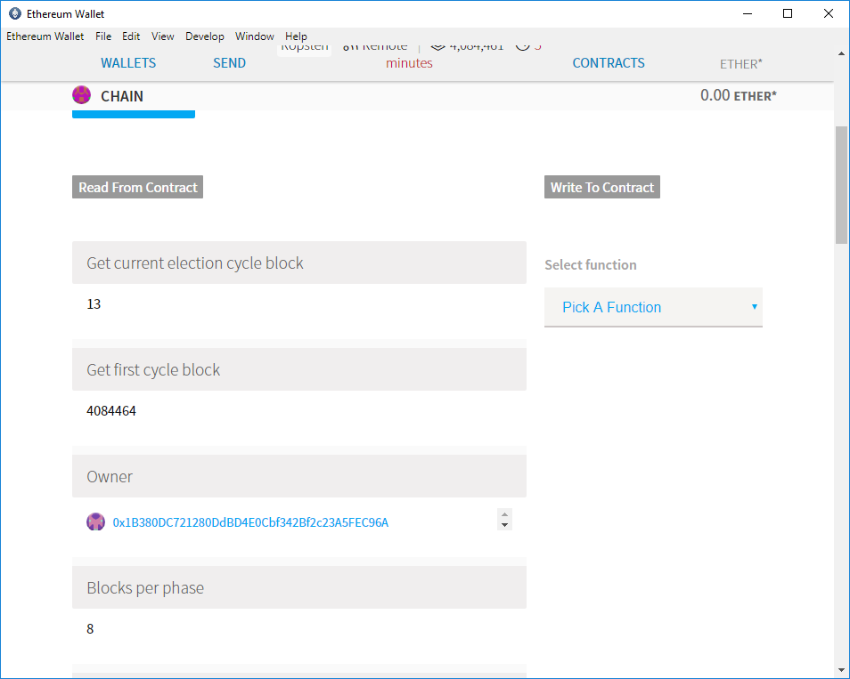

# Andromeda

**Generalized On-Chain Proof-of-Stake Consensus**


## Overview
This repository is a collection of smart contracts to launch Sidechains which can store consensus-driven blocks of information on the Ethereum blockchain.
Each consensus round is based on two phase voting via a commit-reveal mechanism.

Voting rounds are configured be N blocks in length.

The default is to run a new consensus round roughly every hour. 
The proposing round, in which verifiers submit blinded proposals.
The reveal round, in which verifiers reveal the raw consensus value and seed.
The proposing and reveal round are each roughly 30 minutes.

### Consensus Process

* Election has two phases: propose and reveal. Duration of each is: N blocks. 
* Phases going cycle, every `N * 2` blocks new cycle start.
* Noone is in charge of starting phases, its self-controlled mechanism.   
* Each election root results are save to a block and kept on `Chain` contract at `blockHeight` index. 

## Development

---

### Prerequisites

1. [brew](http://brew.sh)

  ```sh
  ruby -e "$(curl -fsSL https://raw.githubusercontent.com/Homebrew/install/master/install)"
  ```

1. [HubFlow](http://datasift.github.io/gitflow/)

  ```sh
  brew install hubflow
  ```

---

## Setup

1. `npm install -g truffle`
1. `git clone git@github.com:kr8os/andromeda.git`
1. `npm install`
1. `git hf init`

### Launch RPC client

```
ganache-cli
```

#### Test with code coverage

Solidity coverage is configured to automatically run testrpc on port 8545.
Please remember to turn off other RPC client before you go for this test. 

### Compiling and migrating smart contracts

1. `truffle compile`
1. `truffle migrate`

## Testing smart contracts

* `truffle test` or `npm run test`
* check for linters errors: `npm run lint`

Please remember, that you can configure the `TestVerifiers.js` to use different number 
of verifiers for performing tests. Please run this test against different values i.e: 
1, 2 and 9.
 
* With code coverage: `npm run coverage`

### Issues during tests

* `Error: ENOENT: no such file or directory, open './allFiredEvents'`

If you experience above issue during coverage test, then create file 
`touch ./allFiredEvents` each time before you run test command, it should help.

* Test hang/freeze during execution  

I think this might be connected to the fact, that we mining a lot during tests 
to move from one to next phase. If this will happen, just cancel the test and run again.    

### Testing on testnet

This is tricky part, because you don't have access to build-in accounts full of ETH :)
You need to create accounts or use coinbase.   

Along with truffle console, you can use Ethereum wallet. 
It allows you to watch contracts (base on provided address and abi).
It will display you all events, help you use getter functions and also 
it will show you in real time current cycle block - this is helpful.  
Below some example screen, how it look like in Ethereum wallet:

 
 
#### Testing in truffle console

The hard part here is that you need have verifier who has token balance. 
Below is a way how to do it:
 
In truffle console `truffle console --network staging`:
```
var chainAddr = '0x62Dcb16E90221B6312044efa7A073b2fed760a7F';
var registryAddr = '0x98db23cbd024fE31D06d496CBdf870000d51BB08';

var tokenAddr = registry.tokenAddress.call().then(addr => tokenAddress = addr);

var registry = VerifierRegistry.at(registryAddr);
var chain = Chain.at(chainAddr);
var humanToken = HumanStandardToken.at(tokenAddr);

# you can use any account as long as you can unlock it  
var verifier = eth.web3.accounts[0];
registry.create('192.168.8.8', { from: verifier }));
```

Lets check, if verifier has a balance
```
registry.verifiers(verifier).then(b => console.log(b[3].toString(10)));
```

If it has, then you are ready. If not, go ahead and execute below commands:
```
humanToken.transfer(verifier, 1);
humanToken.balanceOf(verifier).then(b => console.log(b.toString(10)));

humanToken.approve(registry.address, 1, { from: verifier });
humanToken.allowance(verifier, registry.address).then(b => console.log(b.toString(10)));

registry.receiveApproval(verifier, 0, tokenAddr, '');
registry.verifiers(verifier).then(b => console.log(b[3].toString(10)));
```
...and now you have one verifier ready to vote.

Example how to use Chain:

```
var blind;

# DO NO USE THIS IN REAL LIVE! everyone can see your secret!
chain.createProof('4', '4').then(res => blink = res);

chain.propose(blind);
chain.reveal('4', '4');
chain.getBlockRoot(255311,0);
```

### Deployment

For Test Net you can simple use this:  
```
truffle deploy --network staging
```
Just please update `.env` with `key=value` pairs:
```
DEPLOY_DEV=true|false
INFURA_ACCESS_TOKEN=...
ROPSTEN_MNEMONIC=...
ROPSTEN_PK=...
```
 before deploy. **DO NOT COMMIT THIS VALUES**.


For Main Net I do recommend using ethereum wallet + bytecode. 
It will be much much faster and cheaper. 

#### Ropsten contracts

* development (8 blocks per phase) 
[0x62Dcb16E90221B6312044efa7A073b2fed760a7F](https://ropsten.etherscan.io/address/0x62Dcb16E90221B6312044efa7A073b2fed760a7F)
* staging (140 blocks per phase)
[0x923afd068aed0156d788c10ea875656e095cbf4f](https://ropsten.etherscan.io/address/0x923afd068aed0156d788c10ea875656e095cbf4f)
* production (140 blocks per phase) 
[0xbf9f3e5d89bceede272805b6acaeda91c6f71816](https://ropsten.etherscan.io/address/0xbf9f3e5d89bceede272805b6acaeda91c6f71816)


#### Code verification

1. run `truffle-flattener ./contracts/Chain.sol > all.sol` to combined solidity file.
1. Use Remix + Metamask to deploy contract.
1. Go to your contract on Etherscan.io and choose **Verify And Publish**
1. Copy content of `all.sol` in solidity contract code field
1. Fill in other fields (constructor arguments should be already filled in)
1. Click **Verify and Publish**... and your are done!

## Licensed under MIT.

This code is licensed under MIT.

Permission is hereby granted, free of charge, to any person obtaining a copy of this software and associated documentation files (the "Software"), to deal in the Software without restriction, including without limitation the rights to use, copy, modify, merge, publish, distribute, sublicense, and/or sell copies of the Software, and to permit persons to whom the Software is furnished to do so, subject to the following conditions:

The above copyright notice and this permission notice shall be included in all copies or substantial portions of the Software.

THE SOFTWARE IS PROVIDED "AS IS", WITHOUT WARRANTY OF ANY KIND, EXPRESS OR IMPLIED, INCLUDING BUT NOT LIMITED TO THE WARRANTIES OF MERCHANTABILITY, FITNESS FOR A PARTICULAR PURPOSE AND NONINFRINGEMENT. IN NO EVENT SHALL THE AUTHORS OR COPYRIGHT HOLDERS BE LIABLE FOR ANY CLAIM, DAMAGES OR OTHER LIABILITY, WHETHER IN AN ACTION OF CONTRACT, TORT OR OTHERWISE, ARISING FROM, OUT OF OR IN CONNECTION WITH THE SOFTWARE OR THE USE OR OTHER DEALINGS IN THE SOFTWARE.

## Notice

Except as contained in this notice, the name of the ZeroX Affiliate, LLC DBA Kr8os shall not be used in advertising or otherwise to promote the sale, use or other dealings in this Software without prior written authorization from ZeroX Affiliate, LLC DBA Kr8os.
